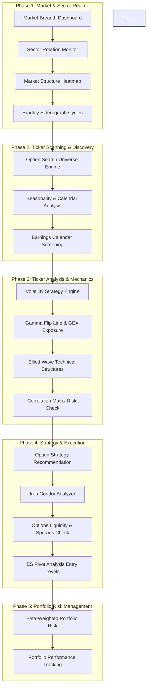

# 📈 FazDane Research Application: Professional Trading Workflow

This document details the end-to-end, multi-stage trading workflow utilizing the active modules in the **FazDane Research Application**. It guides you from top-down macro analysis down to ticker selection, execution, and portfolio risk management.

---

## 🗺️ Workflow Overview

---

## 🔍 Detailed Workflow Steps

### 1. Market & Sector Regime Analysis (Top-Down Macro)
Before picking individual stocks, understand the market structure, trend strength, and sector flow.

*   **Step 1.1: Market Breadth Analysis**
    *   **Module**: `MarketBreadthModule` (Tier 1)
    *   **Goal**: Check the advancing/declining ratios, NYSE/Nasdaq breadth, and McClellan Oscillator. Determine if the broad indexes are trending with strong broad-market support or if the trend is narrowing (divergence), indicating potential exhaustion.
*   **Step 1.2: Sector Relative Strength**
    *   **Module**: `SectorRotationModule` (Tier 1)
    *   **Goal**: View the Relative Strength Index comparisons across the 11 major SPDR sector ETFs. Identify where institutional capital is flowing (e.g., Cyclicals/Tech vs. Defensives/Utilities).
*   **Step 1.3: Market Heatmap Verification**
    *   **Module**: `MarketStructureModule` (Tier 2)
    *   **Goal**: Review sector heatmaps to identify specific industry groups or major megacap market leaders/laggards driving the daily price action.
*   **Step 1.4: Cycle Turning Points**
    *   **Module**: `BradleySiderographModule` (Tier 3)
    *   **Goal**: Consult the Bradley turning points chart to determine if the market is approaching a scheduled cyclical inflection date, which can signify swing highs/lows.

---

### 2. Ticker Scanning & Discovery (Filtering)
Narrow down the universe of thousands of equities to high-probability candidates.

*   **Step 2.1: Options Universe Scoring**
    *   **Module**: `OptionSearchModule` (Tier 1)
    *   **Goal**: Load preset universes (e.g., *Magnificent 7*, *Premium Selling Favorites*, or *Sector ETFs*). The scoring table ranks tickers by a blended index of implied volatility, volume, and premium desirability. Identify top candidates.
*   **Step 2.2: Seasonal & Calendar Alignments**
    *   **Modules**: `CalendarRotationModule` (Tier 1) & `SeasonalityAnalysisModule` (Tier 2)
    *   **Goal**: Filter candidates against historical performance patterns. Verify if the candidate ticker displays strong historical tendencies for the current month-of-year, week-of-year, or day-of-week (e.g., strong bullish seasonality in Q4).
*   **Step 2.3: Event-Based Risk Filtering**
    *   **Module**: `EarningsCalendarModule` (Tier 2)
    *   **Goal**: Look up upcoming earnings dates. For premium-selling strategies, ensure the expiration cycle is clear of binary earnings announcements to avoid sudden gap risk.

---

### 3. Ticker Analysis & Mechanics (Deep-Dive)
Conduct a multi-dimensional assessment of volatility, market maker positioning, and price waves.

*   **Step 3.1: Volatility Diagnostics**
    *   **Module**: `VolatilityEngineModule` (Tier 4)
    *   **Goal**:
        1.  Analyze the Volatility Ratio (HVR) and Implied Volatility (IV) vs. Historical Volatility (HV20). Identify if IV is inflated relative to realized movement.
        2.  Inspect the **IV Term Structure** curve. Ensure the target expiration cycle isn't in severe backwardation unless trading short-duration volatility crashes.
        3.  Check the **Skew Curve**. Assess if puts are trading at an extreme premium over calls (heavy downside hedging).
*   **Step 3.2: Dealer Positioning & Gamma Levels**
    *   **Module**: `GammaFlipLineModule` (Tier 4)
    *   **Goal**:
        1.  Identify the zero-gamma flip point. If spot price is **above** the flip point, the stock is in positive gamma (dampened volatility, rangebound tendencies). If **below**, it is in negative gamma (accelerated volatility, explosive trend breakout potential).
        2.  Analyze the Net GEX exposure curves to pinpoint large dealer positioning walls which serve as strong magnetic support/resistance levels.
*   **Step 3.3: Structural Price Waves**
    *   **Module**: `ElliottWaveAnalysisModule` (Tier 3)
    *   **Goal**: Overlay Elliott Wave identifiers onto the price chart. Confirm if the asset is in an active Wave 3 (strong momentum), a Wave 5 (mature trend), or an A-C correction phase to dictate directional bias.
*   **Step 3.4: Portfolio Diversification Check**
    *   **Module**: `CorrelationMatrixModule` (Tier 2)
    *   **Goal**: Plot a correlation grid between your candidate ticker and your existing core portfolio holdings. Avoid adding highly correlated assets that multiply directional exposure.

---

### 4. Strategy selection & Execution (Opportunity Setup)
Choose the best structure, check bid-ask execution quality, and set exact entry parameters.

*   **Step 4.1: Volatility Strategy Engine Recommendation**
    *   **Module**: `VolatilityEngineModule` -> *Strategy Engine* Tab
    *   **Goal**: View the automated strategy recommendation badge based on the IV/HV ratio and skew profiles (e.g., *AVOID SELLING*, *SELL IRON CONDOR*, *BUY DEBIT SPREADS*).
*   **Step 4.2: Premium Strategy Modeling**
    *   **Module**: `IronCondorModule` (Tier 1)
    *   **Goal**: Model risk parameters. Input the target symbol, select strikes matching standard deviations (from expected moves calculated by the volatility engine), and analyze the credit received, break-evens, margin requirements, and probability of profit bands.
*   **Step 4.3: Liquidity and Slippage Checks**
    *   **Module**: `OptionsLiquidityModule` (Tier 1)
    *   **Goal**: Look up the target expiration and strikes. Review bid-ask spreads, volume, and open interest to guarantee tight execution fills and minimal transaction costs.
*   **Step 4.4: Fine-Tuning Execution Levels**
    *   **Module**: `ESPivotAnalysisModule` (Tier 1)
    *   **Goal**: Utilize intraday support/resistance pivot lines (R1-R3, S1-S3) to set optimal entry limit orders, stop-losses, and profit-target parameters.

---

### 5. Risk Management & Performance Monitoring (Portfolio Management)
Monitor execution, hedge directional risk, and track performance.

*   **Step 5.1: Portfolio Risk Constraints**
    *   **Module**: `PortfolioRiskManagementModule` (Tier 2)
    *   **Goal**: Review live portfolio dashboard stats:
        *   **Beta-Weighted Portfolio Delta**: Keep net portfolio direction risk within your risk limits.
        *   **Total Theta**: Monitor the rate of daily time decay yield.
        *   **Sector Concentration**: Ensure no single sector makes up an excessive percentage of risk capital.
*   **Step 5.2: Performance Attribution**
    *   **Module**: `PortfolioPerformanceModule` (Tier 2)
    *   **Goal**: Track the long-term equity curve, win rate, profit factor, and drawdowns of your accounts to continually refine strategy parameters.
